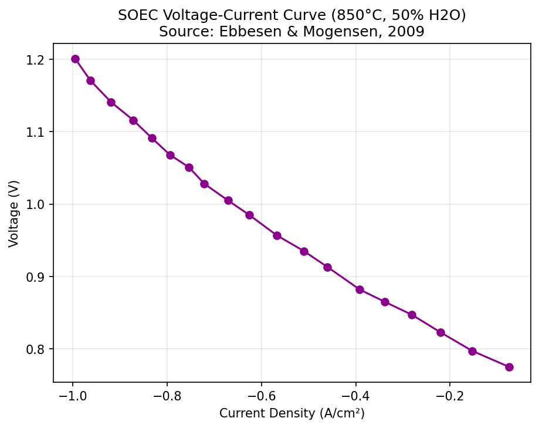
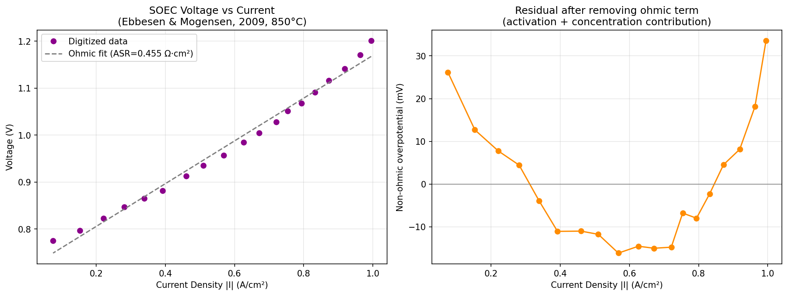
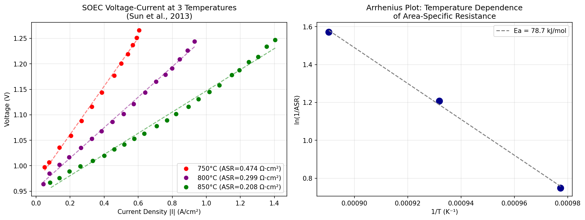

# SOEC Polarization Curve Digitization and Overpotential Analysis

Digitization and quantitative loss (overpotential) analysis of a Solid Oxide Electrolysis Cell (SOEC) polarization curve, extracted from published literature data and analyzed with a custom Python pipeline.

**[Read the full report (PDF)](./SOEC_report.pdf)**

## Overview

Solid oxide cells — used either as fuel cells (SOFC) for power generation or as electrolysis cells (SOEC) for hydrogen production — are a key technology for clean and efficient energy conversion. This project analyzes the voltage–current behavior of an SOEC operating at 850°C, aiming to quantify how different physical loss mechanisms (ohmic, activation, and concentration overpotentials) contribute to overall cell performance.

This was carried out as a self-directed research exercise to build practical experience in scientific data analysis, ahead of applying for summer research programs in energy chemistry.

## Motivation

Sustainable energy conversion technologies — including fuel cells and electrolyzers — are central to reducing dependence on fossil fuels and mitigating climate change. This project served two goals simultaneously: (1) engaging directly with a real electrochemical dataset relevant to solid oxide cell research, and (2) developing applied Python/data-analysis skills through a concrete scientific problem.

## Methodology

1. **Data digitization**: Since no laboratory access was available, voltage–current density data were extracted from a published figure (Ebbesen & Mogensen, 2009 dataset, 850°C, 50% H₂O), reproduced in the supplementary material of Estrada & Cervera (2025, *Applied Sciences*). A custom Python image-processing pipeline (color thresholding + morphological filtering for marker detection, pixel-to-data calibration via axis tick marks) was used to extract 19 data points — a method conceptually equivalent to manual tools such as WebPlotDigitizer.
2. **Loss separation**: Voltage vs. current density was fit to a linear (ohmic) model, `V = V0 + ASR × I`. The residual after subtracting this ohmic term was analyzed to identify the combined contribution of activation and concentration overpotentials.

## Key Results

| Quantity | Value |
|---|---|
| Ohmic fit (850°C) | V = 0.715 + 0.455 × I |
| Apparent area-specific resistance (ASR, 850°C) | 0.455 Ω·cm² |
| Linear fit quality | R² = 0.987 |
| Activation energy (Arrhenius, 3 temperatures) | ≈78.7 kJ/mol |

The residual analysis shows a **U-shaped trend**: non-ohmic overpotential is elevated at both low current density (activation-dominated regime) and high current density (concentration-dominated regime), while the mid-range is almost purely ohmic. This is consistent with expected solid oxide cell electrochemical behavior.

A second, independent dataset (Sun et al., 2013 — three temperatures: 750°C, 800°C, 850°C) was digitized to study how ASR varies with temperature. Fitting an Arrhenius relation yields an activation energy of ~78.7 kJ/mol, consistent with literature values for solid oxide electrolyte ionic conduction — an independent physical consistency check on the digitization and analysis pipeline.

<p align="center">
  
  
  
</p>

## Repository Structure

```
├── analysis.py                      # Full analysis pipeline (load, plot, fit, decompose, Arrhenius)
├── sofc_data_ebbesen2009.csv        # Digitized voltage–current density data, 850°C (19 points)
├── sun2013_multi_temp.csv           # Digitized data at 3 temperatures (53 points)
├── polarization_curve.png           # Figure: raw polarization curve
├── loss_separation.png              # Figure: ohmic fit + residual overpotential
├── temperature_analysis.png         # Figure: multi-temperature curves + Arrhenius plot
└── SOEC_report.pdf                  # Full written report (Introduction–Discussion–References)
```

## Running the Analysis

```bash
pip install pandas numpy matplotlib
python analysis.py
```

## Limitations & Future Work

- The ohmic/non-ohmic decomposition used here is a simplified two-term model; a full three-parameter (activation/ohmic/concentration) fit would require additional data (exchange current density, limiting current density) not recoverable from the source figure alone.
- The dataset now covers two source curves across four operating conditions. The remaining 10 papers compiled in the same supplementary dataset could be digitized similarly for a broader comparative study across cell architectures and geometries.

## Data Source

- Ebbesen, S.D. & Mogensen, M. (2009). Electrolysis of carbon dioxide in Solid Oxide Electrolysis Cells. *Journal of Power Sources*, 193(1), 349–358.
- Estrada, N.G.A. & Cervera, R.B.M. (2025). Machine Learning-Based Predictive Modelling for Solid Oxide Electrolysis Cell's (SOEC) Electrochemical Performance. *Applied Sciences*, 15(17), 9388.

## Author

**Benyamin Mohammadzadeh Madiyeh**
Applied Chemistry, K.N. Toosi University of Technology
